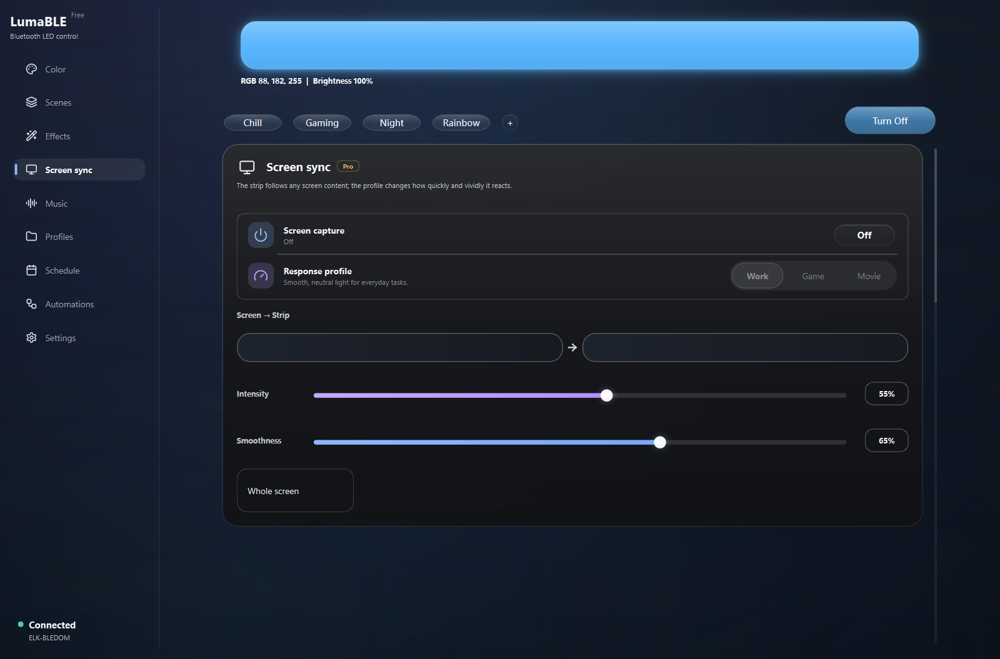

<p align="center">
  
</p>

<h1 align="center">LumaBLE</h1>

<p align="center">
  A polished Windows desktop app for controlling Bluetooth LED strips.
</p>

<p align="center">
  <a href="https://github.com/DanKo12345/lumable/releases">
    
  </a>
  
  
  <a href="https://github.com/DanKo12345/lumable/issues">
    
  </a>
</p>

<p align="center">
  <a href="https://github.com/DanKo12345/lumable/releases"><strong>Download for Windows</strong></a>
  &nbsp;&middot;&nbsp;
  <a href="#supported-controllers">Supported controllers</a>
  &nbsp;&middot;&nbsp;
  <a href="https://github.com/DanKo12345/lumable/issues/new/choose">Report a problem</a>
</p>

<p align="center">
  <a href="README.ru.md">Русский</a> &nbsp;|&nbsp;
  <a href="README.es.md">Español</a> &nbsp;|&nbsp;
  <a href="README.zh.md">中文</a>
</p>


LumaBLE discovers compatible BLE LED controllers nearby and gives them a proper desktop interface:
colour, brightness, power, effects, scenes, screen and audio sync, profiles, schedules and automation
rules. It is designed for repeated everyday use rather than one-off controller setup.

> LumaBLE is currently in beta. Controller protocols vary between manufacturers, so please attach a
> diagnostics report when requesting support for a new model.

## Highlights

- **Direct light control** — RGB, brightness, colour temperature, power and a HEX/HSV picker.
- **Scenes and effects** — reusable scenes, quick modes, controller effects and app-rendered animations.
- **Screen and audio sync** — make the strip follow desktop content or music in real time.
- **Automations** — react to time, foreground apps, idle time, LumaBLE startup or strip connection.
- **Background schedules** — Pro power rules can run through Windows even while LumaBLE is closed.
- **Local API** — pair a phone on the same network and control lights from a mobile browser.
- **Diagnostics** — export controller, protocol and BLE details without digging through log files.
- **Accessible desktop UI** — keyboard navigation, reduced-motion support, light and dark themes.
- **Four interface languages** — English, Russian, Spanish and Chinese, detected on first launch.

## Inside The App

| Automation rules | Screen sync |
| --- | --- |
|  |  |

## Download And Start

1. Open the [Releases page](https://github.com/DanKo12345/lumable/releases).
2. Download `LumaBLE-Setup-<version>.exe` and run the installer.
3. Power on the LED controller and close any phone app currently connected to it.
4. Open LumaBLE, click the connection status and scan for the controller.

The current Windows beta is not code-signed, so Microsoft Defender SmartScreen may show an
"Unknown publisher" warning. Release files are built from this repository and published on GitHub.

## Free And Pro

Core controller discovery and light control are free. Pro unlocks screen sync, music sync, the full
effect library, DIY effects, import/export, unlimited profiles, custom quick modes and schedules that
run while LumaBLE is closed. Hardware compatibility is never restricted to Pro.

## Supported Controllers

- BLEDOM / ELK-BLEDOM compatible controllers.
- Magic Home / MagicLight BLE controllers.
- BanlanX SP61x / SP62x BLE controllers.
- Triones / Happy Lighting compatible BLE controllers.

Support depends on the protocol advertised by the controller, not only the product name. If a model
is missing, use the
[Unsupported controller form](https://github.com/DanKo12345/lumable/issues/new?template=unsupported_controller.yml).

## Build From Source

LumaBLE targets Python 3.11 on Windows.

```powershell
py -3.11 -m venv .venv311
.\.venv311\Scripts\python.exe -m pip install -r requirements.txt
.\run_app.bat
```

Developer tools:

```powershell
.\.venv311\Scripts\python.exe -m pip install -r requirements-dev.txt
.\.venv311\Scripts\python.exe -m pytest
.\.venv311\Scripts\python.exe -m ruff check .
```

## App Data

Application data is stored through `platformdirs`. On Windows this is normally:

```text
%APPDATA%\LumaBLE
```

Custom translation JSON files can be placed in `%APPDATA%\LumaBLE\i18n`.

## Reporting Issues

Use the matching GitHub form for a
[bug, feature request or unsupported controller](https://github.com/DanKo12345/lumable/issues/new/choose).
For BLE problems, scan once and then open **Settings → Diagnostics → Export diagnostics**. Attach the
exported `.txt` report to the issue; it contains the controller details needed to investigate protocol
support.

Author: `dollza`

Current release: `0.3.6 beta`
