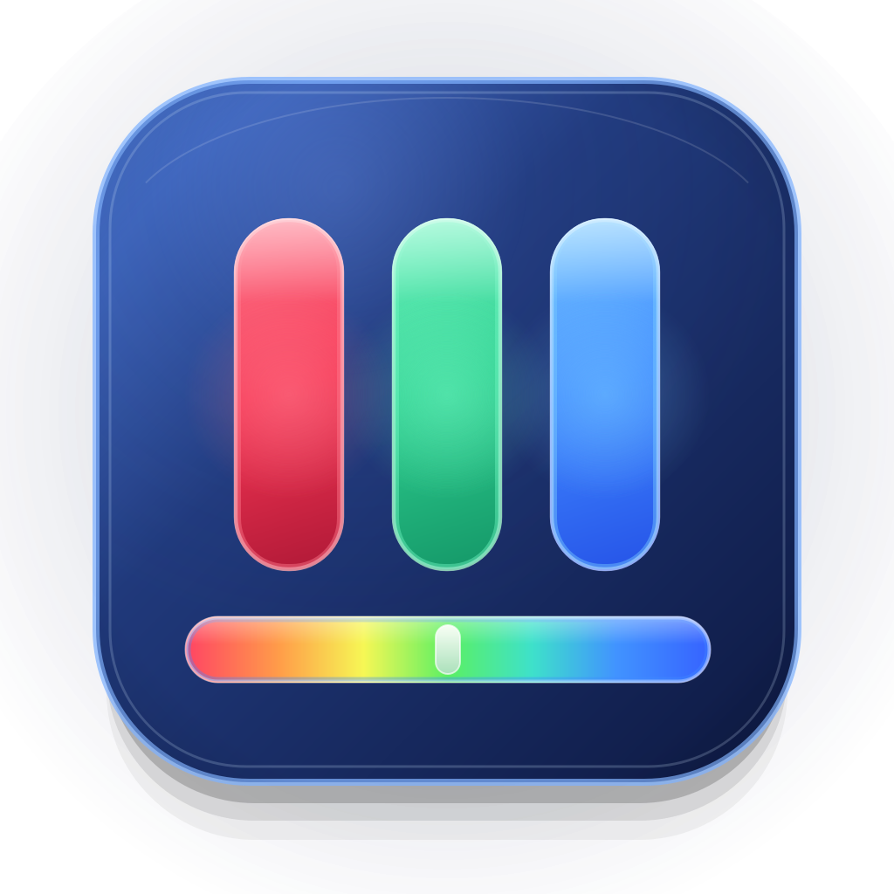
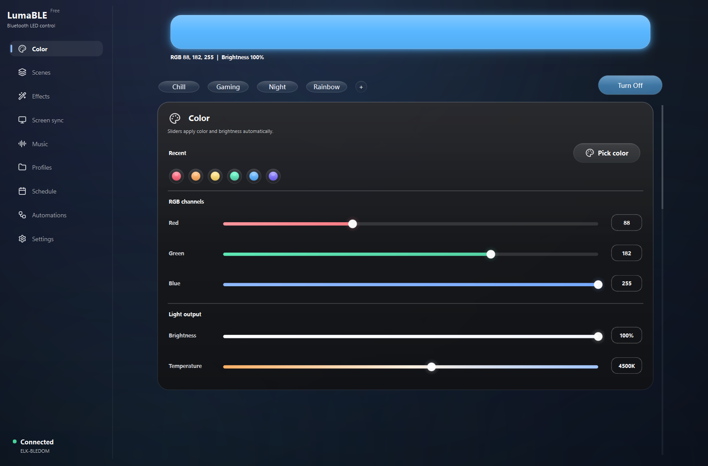
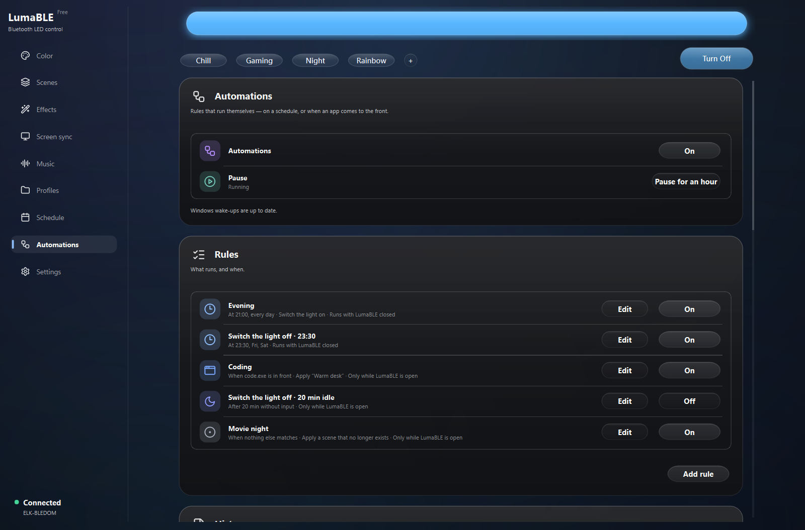

<p align="center">
  
</p>

<h1 align="center">LumaBLE</h1>

<p align="center">
  <b>Turn a cheap ELK-BLEDOM Bluetooth strip into responsive PC lighting. No hub required.</b>
</p>

<p align="center">
  <a href="https://github.com/DanKo12345/lumable/releases">
    
  </a>
</p>

<p align="center">
  <a href="#supported-controllers">Supported controllers</a>
  &nbsp;&middot;&nbsp;
  <a href="https://github.com/DanKo12345/lumable/issues/new/choose">Report a problem</a>
</p>

<p align="center">
  <sub>
    Read in:
    <a href="README.ru.md">Русский</a> &nbsp;·&nbsp;
    <a href="README.es.md">Español</a> &nbsp;·&nbsp;
    <a href="README.zh.md">中文</a>
  </sub>
</p>



Inexpensive Bluetooth LED strips — **ELK-BLEDOM**, **Triones** / Happy Lighting, **Magic Home**,
**BanlanX SP61x / SP62x** — normally come with a phone app and nothing else. LumaBLE gives them a
real Windows application: the strip follows what is on your screen, reacts to whatever the PC is
playing, and switches scenes by itself when you open a game.

No hub, no bridge, no account. The controller you already own, driven from the desktop.

> LumaBLE is currently in beta. Controller protocols vary between manufacturers, so please attach a
> diagnostics report when requesting support for a new model.

## Highlights

- **Direct light control** — RGB, brightness, colour temperature, power and a HEX/HSV picker.
- **Scenes and effects** — reusable scenes, quick modes, controller effects and app-rendered animations.
- **Screen and audio sync** — make the strip follow desktop content or music in real time.
- **Automations** — react to time, foreground apps, idle time, strip connection and Windows lock or sleep.
- **Windows shortcuts** — use tray actions and optional global hotkeys without opening the main window.
- **Background schedules** — Pro power rules can run through Windows even while LumaBLE is closed.
- **Local API** — pair a phone on the same network and control lights from a mobile browser.
- **Portable backup** — move scenes, rules, groups and settings without exporting device addresses or secrets.
- **Diagnostics** — export controller, protocol and BLE details without digging through log files.
- **Accessible desktop UI** — keyboard navigation, reduced-motion support, light and dark themes.
- **Four interface languages** — English, Russian, Spanish and Chinese, detected on first launch.

## Inside The App

| Automation rules | Screen sync |
| --- | --- |
|  |  |

## Download And Start

1. Open the [Releases page](https://github.com/DanKo12345/lumable/releases).
2. Download `LumaBLE-Setup-<version>.exe` and run the installer.
3. Power on the LED controller and close any phone app currently connected to it.
4. Open LumaBLE, click the connection status and scan for the controller.

The current Windows beta is not code-signed, so Microsoft Defender SmartScreen may show an
"Unknown publisher" warning. Release files are built from this repository and published on GitHub.

## Free And Pro

Core controller discovery and light control are free. Pro unlocks screen sync, music sync, the full
effect library, DIY effects, import/export, unlimited profiles, custom quick modes and schedules that
run while LumaBLE is closed. Hardware compatibility is never restricted to Pro.

## Supported Controllers

- BLEDOM / ELK-BLEDOM compatible controllers.
- Magic Home / MagicLight BLE controllers.
- BanlanX SP61x / SP62x BLE controllers.
- Triones / Happy Lighting compatible BLE controllers.

### Recognised, control not yet supported

- **BanlanX SP630E** — LumaBLE identifies it from its advertisement, but does not send it commands.
  The command protocol has not been verified against real hardware yet. Select it and use
  **Check** to run a read-only look at what it offers, then save the **BLE scan report** from
  Diagnostics and attach it to
  [issue #2](https://github.com/DanKo12345/lumable/issues/2).

### Reporting a controller LumaBLE does not know

Run a scan, then **Diagnostics → BLE scan report**. The file records what every nearby device
broadcast — including devices filtered out of the visible list, which is where an unrecognised
controller ends up. It can contain technical identifiers inside the advertised payloads, so have a
look before posting it publicly.

Support depends on the protocol advertised by the controller, not only the product name. If a model
is missing, use the
[Unsupported controller form](https://github.com/DanKo12345/lumable/issues/new?template=unsupported_controller.yml).

## Build From Source

LumaBLE targets Python 3.11 on Windows.

```powershell
py -3.11 -m venv .venv311
.\.venv311\Scripts\python.exe -m pip install -r requirements.txt
.\run_app.bat
```

Developer tools:

```powershell
.\.venv311\Scripts\python.exe -m pip install -r requirements-dev.txt
.\.venv311\Scripts\python.exe -m pytest
.\.venv311\Scripts\python.exe -m ruff check .
```

## App Data

Application data is stored through `platformdirs`. On Windows this is normally:

```text
%APPDATA%\LumaBLE
```

Custom translation JSON files can be placed in `%APPDATA%\LumaBLE\i18n`.

## Reporting Issues

Use the matching GitHub form for a
[bug, feature request or unsupported controller](https://github.com/DanKo12345/lumable/issues/new/choose).
For BLE problems, scan once and then open **Settings → Diagnostics → Export diagnostics**. Attach the
exported `.txt` report to the issue; it contains the controller details needed to investigate protocol
support.

Author: `dollza`

Current release: `0.3.9 beta`
