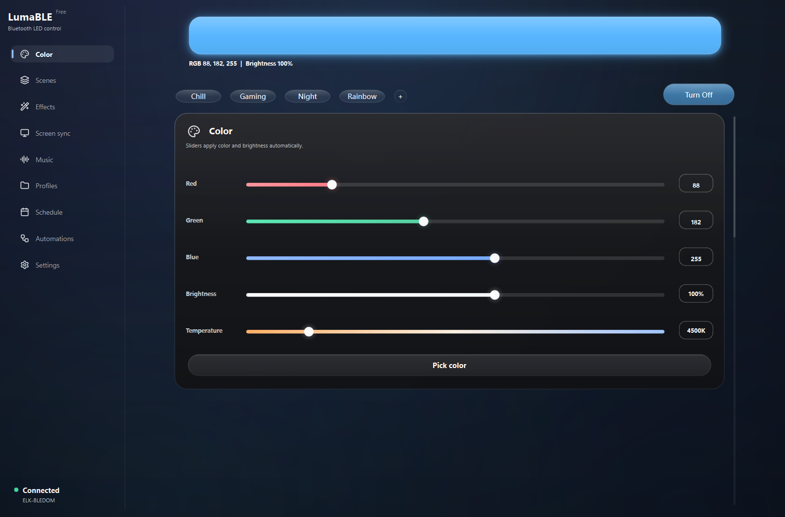

# LumaBLE

Windows-приложение для управления BLE RGB-контроллерами светодиодных лент.

LumaBLE ищет поддерживаемые Bluetooth-контроллеры, подключается к устройству, меняет RGB-цвет,
яркость и питание, применяет встроенные эффекты, настраивает скорость эффектов и сохраняет
пользовательские профили подсветки. Также доступны синхронизация с экраном и музыкой, сцены,
правила автоматизации, локальный API, диагностика и светлая/тёмная темы.

Автор: `dollza`

Версия: `0.3.6 beta`

Скачать последнюю Windows-сборку можно на странице [Releases](https://github.com/DanKo12345/lumable/releases).

Если нашли ошибку или контроллер не работает, создайте
[Issue](https://github.com/DanKo12345/lumable/issues).

Другие языки:

- [English](README.md)
- [Español](README.es.md)
- [中文](README.zh.md)



## Возможности

- Управление RGB, яркостью, цветовой температурой и питанием.
- Сцены, быстрые режимы, встроенные и программные эффекты.
- Синхронизация подсветки с экраном и музыкой.
- Автоматизации по времени, активному приложению, простою, запуску LumaBLE и подключению ленты.
- Pro-расписания питания, работающие через Windows даже при закрытом LumaBLE.
- Локальный API для управления с телефона в одной сети.
- Экспорт диагностики для неподдерживаемых контроллеров и проблем BLE.
- Клавиатурная навигация, уменьшение движения и четыре языка интерфейса.

## Поддерживаемые Контроллеры

- BLEDOM / ELK-BLEDOM совместимые контроллеры.
- Magic Home / MagicLight BLE контроллеры.
- BanlanX SP61x / SP62x BLE контроллеры.
- Triones / Happy Lighting совместимые BLE LED-контроллеры.

## Установка На Windows

```powershell
py -3.11 -m venv .venv
.\.venv\Scripts\python.exe -m pip install -r requirements.txt
```

Инструменты для тестов и релизной сборки:

```powershell
.\.venv\Scripts\python.exe -m pip install -r requirements-dev.txt
```

## Запуск

```powershell
.\run_app.bat
```

## Тесты

```powershell
.\.venv311\Scripts\python.exe -m pytest
```

```powershell
.\.venv311\Scripts\python.exe -m ruff check .
```

## Данные Приложения

Данные приложения хранятся в стандартной пользовательской папке через `platformdirs`.
На Windows это обычно:

```text
%APPDATA%\LumaBLE
```

Пользовательские переводы можно положить JSON-файлами в:

```text
%APPDATA%\LumaBLE\i18n
```

Папка `data/` в проекте используется только как legacy-источник для первой миграции старых
профилей и настроек. Её не нужно коммитить или добавлять в публичные архивы.

## Как Сообщить О Проблеме

В отчёте об ошибке или неподдерживаемом контроллере укажите:

- Версию Windows.
- Версию LumaBLE.
- Имя контроллера, которое показывает приложение.
- Что вы пытались сделать.
- Что произошло вместо ожидаемого.
- Диагностический отчёт, если возможно.

Как экспортировать диагностику:

1. Откройте LumaBLE.
2. Откройте диагностику устройства.
3. Нажмите «Скопировать диагностику» или «Экспорт диагностики».
4. Вставьте отчёт в GitHub issue или прикрепите экспортированный `.txt` файл.
